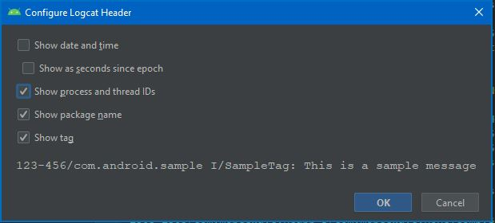
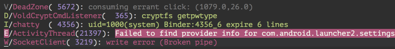
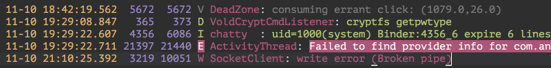
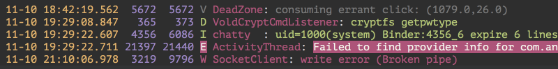
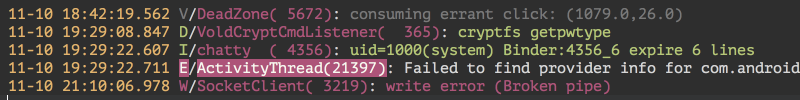
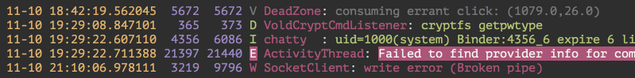
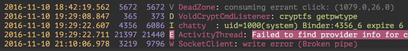

# sublime-logcat

Syntax Definitions combined with a "detection script" for Sublime Text to display colorized logcat output:

 - captured by `adb logcat`, or
 - copied from Android Studio

## Installation

Do either:

- Download this repo, rename it to 'Logcat', and place it in your Sublime Text `Packages` folder.
  - Open it from Sublime Text from: `Preferences` > `Browse Packages…`
  
- Clone the repo into your `Packages` folder.

## Usage

1. From `Tools` > `Command Palette` or <kbd>Ctrl</kbd> + <kbd>Shift</kbd> + <kbd>P</kbd>
1. `detect logcat`
1. If a syntax is detected you will see the text colorized.  The according Syntax is selected under `View` > `Syntax`.

## Supported Formats

### Android Studio

- Set the logcat output style from Android Studio **[`Configure Locat Header`](https://developer.android.com/studio/debug/am-logcat#running)** dialog as follows:

#### Default - `AS-default`

  > `2018-02-06 17:16:28.555 123-456/com.android.sample I/SampleTag: This is a sample message`
  
  - [x] Show date and time
    - [ ] Show as seconds
  - [x] Show process and thread IDs
  - [x] Show package name
  - [x] Show tag
  
#### No Date & Time - `AS-noDateTime`

  > `123-456/com.android.sample I/SampleTag: This is a sample message`
  
  - [ ] Show date and time
    - [ ] Show as seconds
  - [x] Show process and thread IDs
  - [x] Show package name
  - [x] Show tag
  
    (As shown here:)
  
    
  

### [`adb logcat -v` formats](https://developer.android.com/studio/command-line/logcat#outputFormat)

#### brief 

  

#### printable 

  

#### threadtime 

  

#### time 

  

#### usec 

  

#### year 

  

## Attribution
Some of the Logcat language definitions are from https://github.com/leesei/logcat.tmLanguage.
